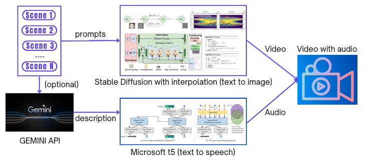
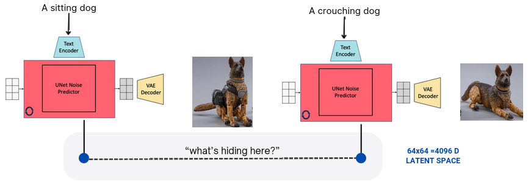
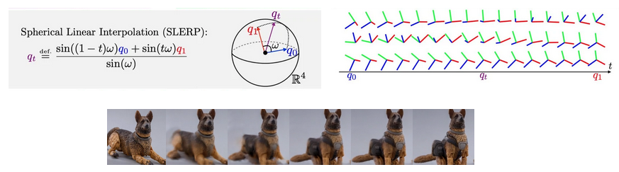

Result: (no audio here)

This project focuses on generating videos by interpolating 'N' input scenes using a stable diffusion pipeline. The goal is to create a smooth transition between scenes, resulting in a high-quality video playback at 24 frames per second (FPS). The interpolation is facilitated through the FiLM (Feature-wise Linear Modulation) technique, enhancing the visual coherency of the generated frames.

Additionally, the project incorporates the conversion of audio prompts, provided as descriptions, into corresponding audio tracks. The final output combines the generated video frames with the synchronized audio tracks, creating a cohesive audio-visual experience.

By interpolating in the latent space of stable diffusion, the project navigates through this abstract representation, allowing for a more controlled and nuanced transition between scenes.

Spherical interpolation takes into account the geometry of the hypersphere, which ensures a smooth and shortest-path interpolation between two rotations.

